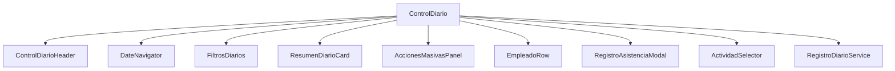

# Plan Arquitectura ControlDiario

## Jerarquia de componentes

## Props principales

| Componente | Props clave |
|-----------|-------------|
| ControlDiarioHeader | `FechaSeleccionada`, `ErrorMessage`, `SuccessMessage`, `OnClearError` |
| DateNavigator | `@bind-FechaSeleccionada`, `OnFechaChanged` |
| FiltrosDiarios | `@bind-SearchTerm`, `OnFilterChanged` |
| ResumenDiarioCard | `TotalRegistros`, `RegistrosFiltrados`, `Completados`, `Pendientes`, `TotalHoras`, `SearchTerm` |
| AccionesMasivasPanel | `EmpleadosSinRegistroCount`, `OnCargarRegistros`, `OnCrearRegistros` |
| EmpleadoRow | `Registro`, `IsSelected`, `EditandoEntradaId`, `EditandoSalidaId`, callbacks de acciones |
| RegistroAsistenciaModal | `RegistroSeleccionado`, `MostrarDetalle`, `EditandoObservaciones`, callbacks CRUD |
| ActividadSelector | `MostrarModal`, `ActividadEdit`, `CategoriasActividad`, `ActividadesFiltradas`, `Proyectos`, callbacks |

## Flujo de datos

1. `ControlDiario` carga maestros y registros por fecha.
2. `RegistroDiarioService` retorna registros con detalles en batch.
3. `ControlDiario` vincula empleados y aplica filtros.
4. Cambios de UI disparan callbacks y actualizaciones puntuales.

## Estrategia de optimizacion

1. **Carga batch**
   - Detalles de actividades por lista de ids de registros.
2. **Asignacion local**
   - Empleados vinculados desde cache local para evitar N+1.
3. **Componentizacion**
   - Evitar re-render global con componentes mas pequeños.
